# DCInside User Filter


디시인사이드의 게시글과 댓글을 조건에 따라 걸러내고, 모바일 화면을 읽기 편하게 다듬는 Tampermonkey 사용자 스크립트입니다.

핵심은 활동량이 적은 계정, 특정 글·댓글 비율, 통신사·우회 IP, 유동 사용자를 원하는 기준으로 차단하는 기능입니다. 닉네임·UID·IP를 직접 차단하고 목록을 백업하거나 복원할 수 있으며, 5가지 UI 색상 프리셋으로 필터 메뉴와 모바일 화면을 취향에 맞게 조정할 수 있습니다.

## 바로 설치

| 대상 | 설치 | 용도 |
| --- | --- | --- |
| PC | [PC 안정 버전 설치](https://github.com/domato153/dc-uidfiltering/raw/refs/heads/main/dcinside_user_filter.user.js) | 필터링, 개인 차단, 설정·관리 UI |
| 모바일 | [모바일 안정 버전 설치](https://github.com/domato153/dc-uidfiltering/raw/refs/heads/Mobile/Dc_UserFilter_Mobile.user.js) | 필터링 + 모바일 목록·본문·댓글·글쓰기 UI |

설치 버튼을 눌렀는데 코드만 보인다면 아래의 [설치 방법](#설치-방법)을 먼저 확인하세요.

## 주요 기능

### 1. 깡계 활동량 필터

- 작성글과 댓글 수의 합이 설정값 이하인 계정 차단
- 댓글/글 또는 글/댓글 비율이 지나치게 높은 계정 차단
- 기준값을 `0`으로 두어 활동량 필터만 끄기
- 공지·개념글 등 기존 예외 동작 유지

### 2. 유동·IP 필터

- 유동 사용자 전체 차단
- 통신사 IP 차단
- 우회 IP 차단 강도 선택: 끔 / 확실한 우회 / 공격적 우회
- 잘못 차단될 가능성이 있는 옵션은 사용자가 직접 선택

### 3. 개인 차단

- 닉네임, UID(식별번호), IP 단위 차단
- 글 목록과 본문에서 간편차단 메뉴 사용
- 탭별 차단 목록 확인 및 개별 삭제
- 개인 차단 기능만 즉시 켜거나 끄기
- 차단 목록 파일 저장, 클립보드 복사, 병합 복원

### 4. 모바일 화면 최적화

- PC 갤러리 목록을 모바일 카드형 목록으로 재구성
- 본문·댓글·관련글을 작은 화면에 맞게 정렬
- 글쓰기 화면, 팝업 위치와 터치 영역 보정
- 다크 화면과 스크립트 팝업 스타일 대응
- 비회원 글 수정의 비밀번호 확인·편집 화면 대응
- 광고 게시물과 일부 불필요한 레이아웃 정리

### 5. UI 색상 프리셋

- 기본 블루 / 퍼플 / 그린 / 오렌지 / 모노톤 5가지 프리셋
- 저장 전 즉시 미리보기와 기본값 복원
- 모바일 목록·본문·댓글·글쓰기와 필터 메뉴에 일관된 색상 적용
- PC에서는 필터 버튼과 설정·차단·백업 팝업에만 제한적으로 적용
- PC와 모바일이 같은 저장 설정을 사용

### 6. 동적 콘텐츠 대응

- 늦게 추가된 댓글과 게시글에도 필터 재적용
- 목록 교체와 댓글 다시 불러오기 대응
- 한 번 차단한 UID 통계를 일정 기간 캐시해 반복 요청 감소

## 화면

### UI 색상 프리셋과 플로팅 메뉴

<p align="center">
  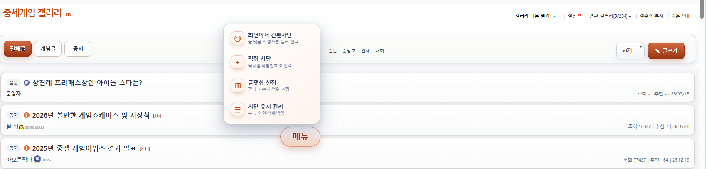
</p>
<p align="center">
  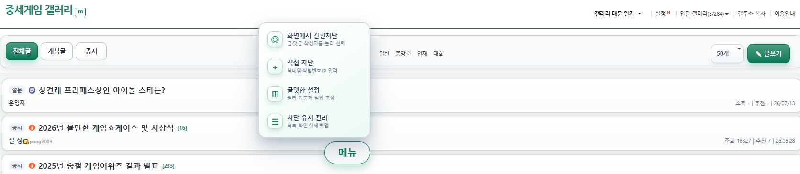
  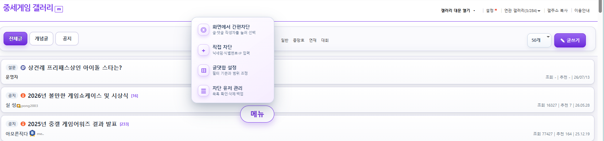
</p>
<p align="center">
  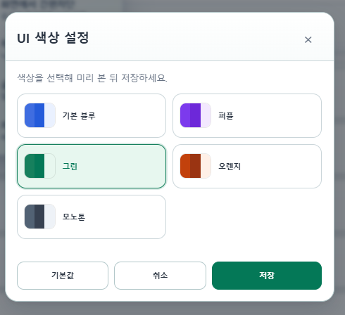
</p>

색상은 저장 전에 바로 미리 볼 수 있습니다. 모바일은 갤러리 화면 전체의 강조색이 바뀌며, PC는 DCUF가 만든 필터 버튼과 팝업만 바뀌어 원래 사이트 UI는 유지됩니다.

### 글 리스트, 글 내용, 글 작성

<p align="center">
  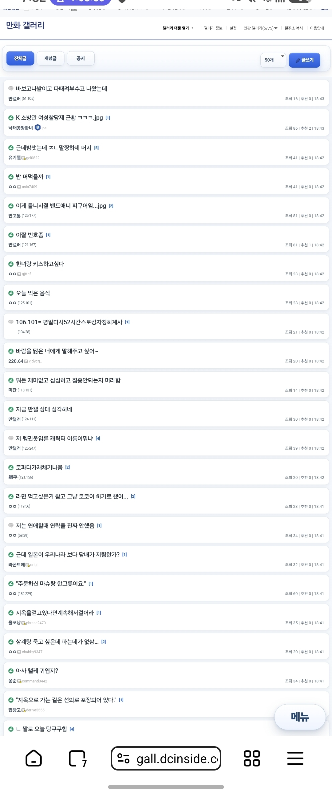
  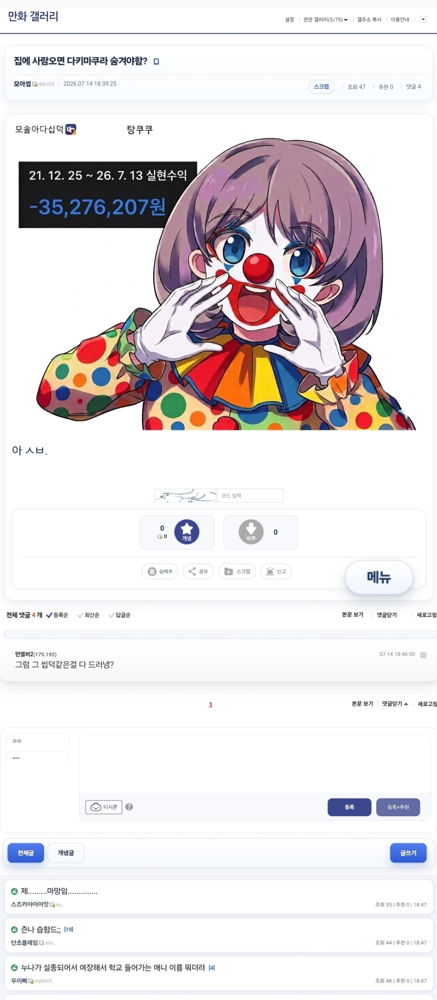
  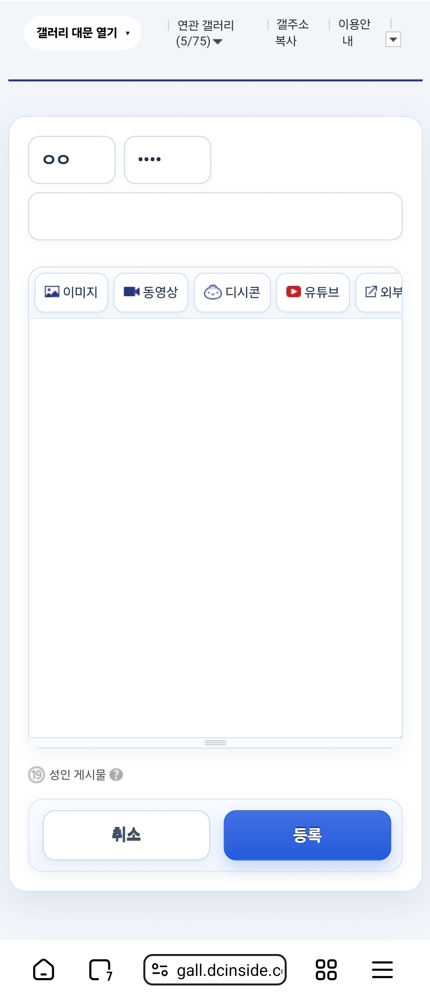
</p>

### 필터 설정

<p align="center">
  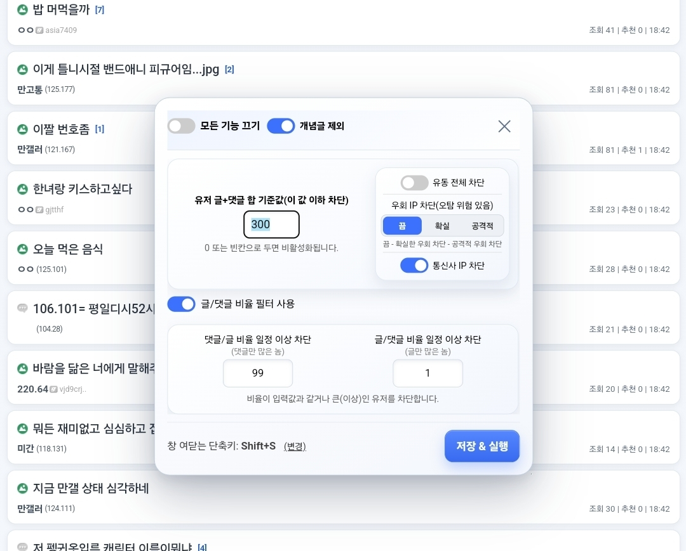
</p>

### 모바일 메뉴와 Tampermonkey 메뉴

<p align="center">
  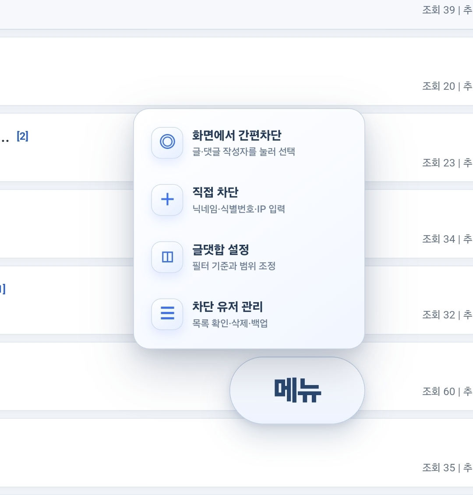
  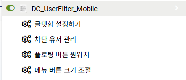
</p>

### 직접 차단과 차단 목록 관리

<p align="center">
  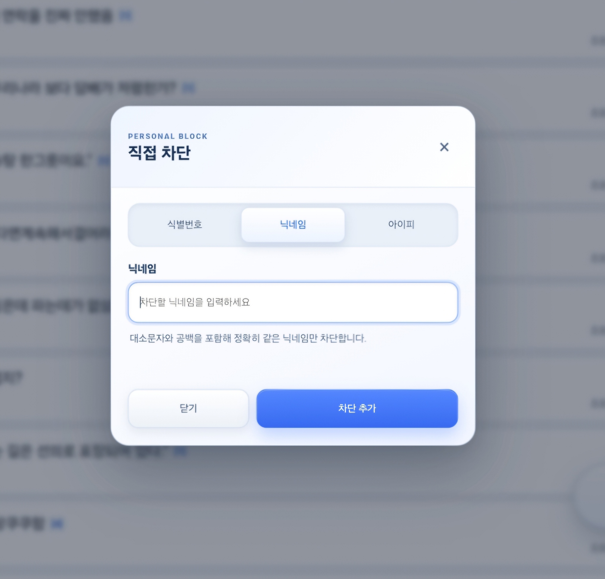
  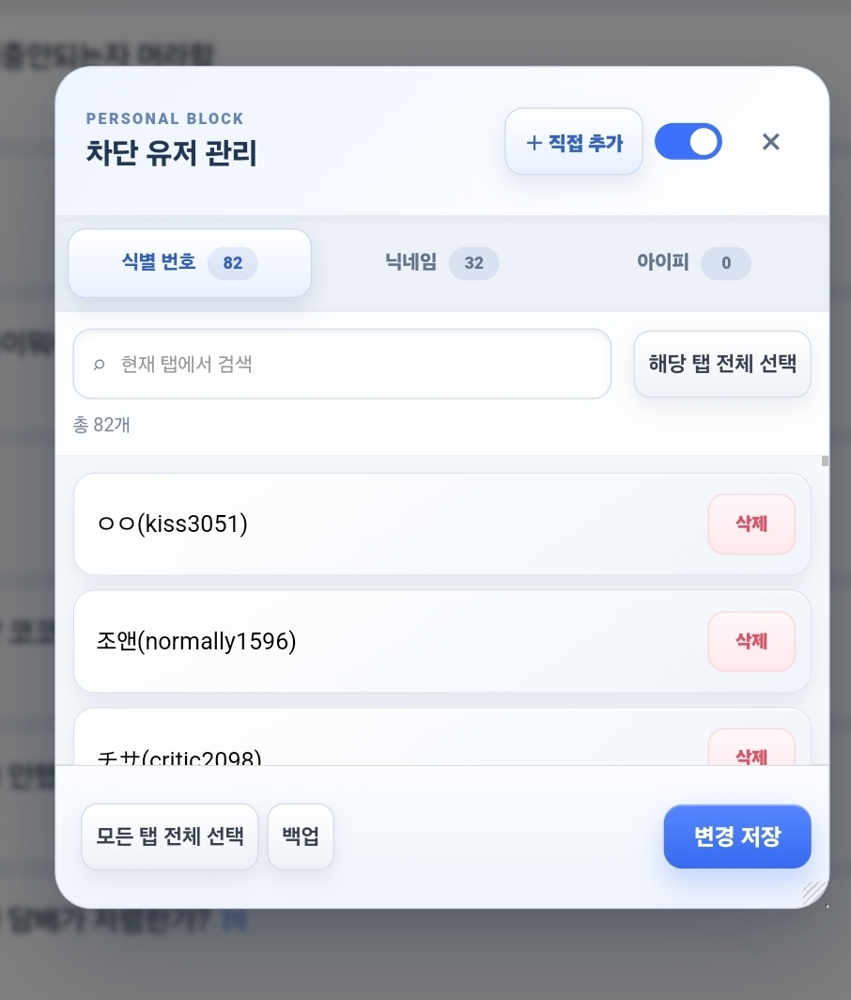
</p>

### 차단 목록 백업과 복원

<p align="center">
  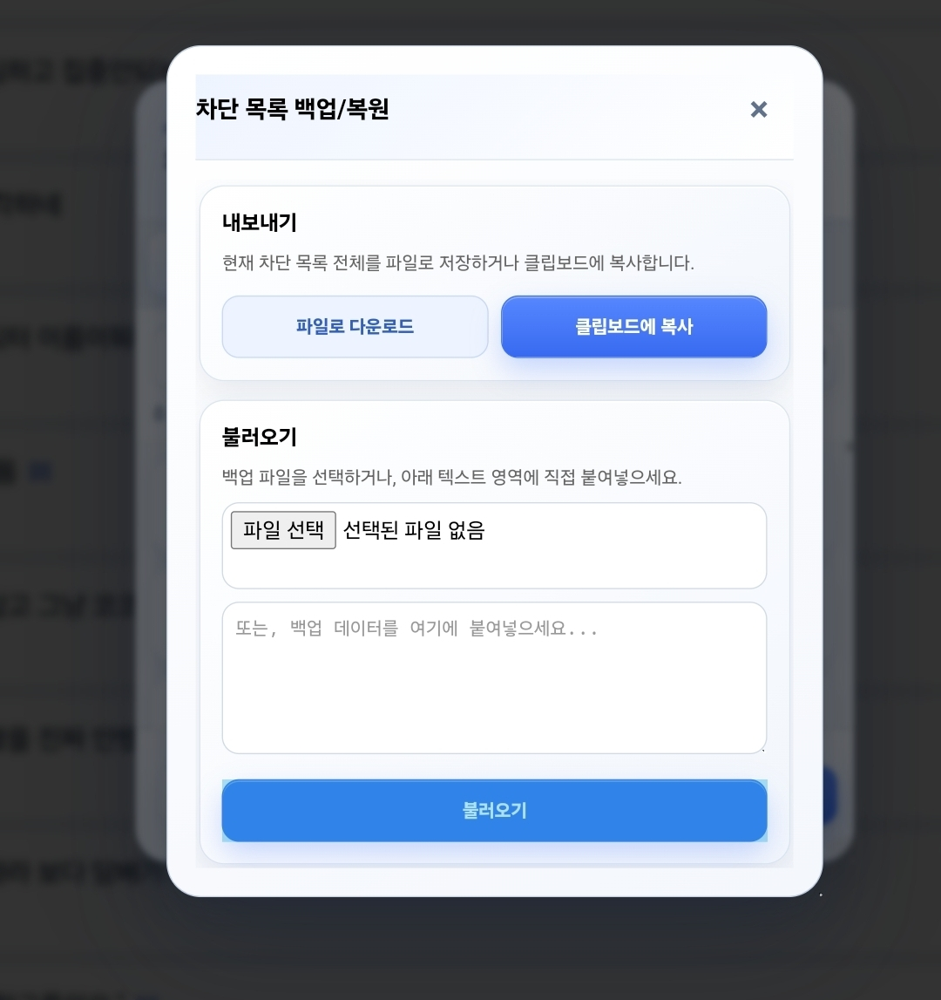
</p>

## 설치 방법

### PC

1. Chrome, Edge, Vivaldi 등 Chromium 기반 브라우저에 [Tampermonkey](https://www.tampermonkey.net/)를 설치합니다.
2. 브라우저 확장 프로그램 관리 화면에서 **개발자 모드**를 켭니다.
3. [PC 안정 버전 설치](https://github.com/domato153/dc-uidfiltering/raw/refs/heads/main/dcinside_user_filter.user.js)를 누릅니다.
4. Tampermonkey 설치 화면에서 스크립트를 설치합니다.
5. 디시인사이드 페이지를 새로고침합니다.

### 모바일

1. 확장 프로그램을 지원하는 Chromium 기반 모바일 브라우저를 준비합니다.(Lemur 추천, Edge도 가능)
2. Tampermonkey 또는 Tampermonkey Legacy를 설치합니다.
3. 가능하면 브라우저에서 **데스크톱 사이트를 기본값**으로 설정합니다.
4. [모바일 안정 버전 설치](https://github.com/domato153/dc-uidfiltering/raw/refs/heads/Mobile/Dc_UserFilter_Mobile.user.js)를 누릅니다.
5. 설치 화면이 열리지 않으면 Tampermonkey의 `도구 → Import from URL`에 아래 주소를 붙여넣습니다.

```text
https://github.com/domato153/dc-uidfiltering/raw/refs/heads/Mobile/Dc_UserFilter_Mobile.user.js
```

## 사용 방법

- Tampermonkey 메뉴의 **글댓합 설정하기**에서 자동 필터 기준을 정합니다.
- Tampermonkey 메뉴의 **UI 색상 설정**에서 5가지 프리셋을 미리 보고 저장합니다.
- 모바일에서는 우측 하단의 필터 메뉴에서 **간편차단**, **글댓합 설정**, **차단 유저 관리**를 열 수 있습니다.
- **차단 유저 관리**에서 개인 차단을 켜거나 끄고, 목록을 삭제·백업·복원할 수 있습니다.
- 처음에는 낮은 강도의 기준부터 적용한 뒤 실제 차단 결과를 확인하는 것을 권장합니다.

## PC와 모바일 차이

| 기능 | PC | 모바일 |
| --- | :---: | :---: |
| 글+댓글 합·비율 필터 | ✓ | ✓ |
| 유동·통신사·우회 IP 차단 | ✓ | ✓ |
| 닉네임·UID·IP 개인 차단 | ✓ | ✓ |
| 차단 목록 관리·백업 | ✓ | ✓ |
| UI 색상 프리셋 | ✓ (필터 UI) | ✓ |
| 모바일 목록·본문·댓글 재배치 | — | ✓ |
| 모바일 글쓰기·수정·팝업 보정 | — | ✓ |

## 주의사항

- 우회 IP의 **공격적 차단**은 정상 사용자를 잘못 차단할 수 있습니다.
- 광고 차단 확장 또는 앱이 초기 로딩과 충돌할 수 있습니다. 문제가 생기면 디시인사이드를 예외 처리한 뒤 다시 확인하세요.
- 사이트 DOM 변경, 브라우저 확장 정책, Tampermonkey 버전에 따라 일부 기능이 일시적으로 동작하지 않을 수 있습니다.
- 차단 설정과 목록은 브라우저의 Tampermonkey 저장소에 보관됩니다. 브라우저나 확장을 삭제하기 전에 백업하세요.

## 문제 제보

[GitHub Issues](https://github.com/domato153/dc-uidfiltering/issues)에 아래 정보를 함께 남겨 주세요.

- PC 또는 모바일 구분
- 브라우저와 Tampermonkey 버전
- 문제가 발생한 페이지 종류: 목록 / 본문 / 댓글 / 글쓰기 / 글 수정
- 재현 순서와 개인정보를 가린 스크린샷
